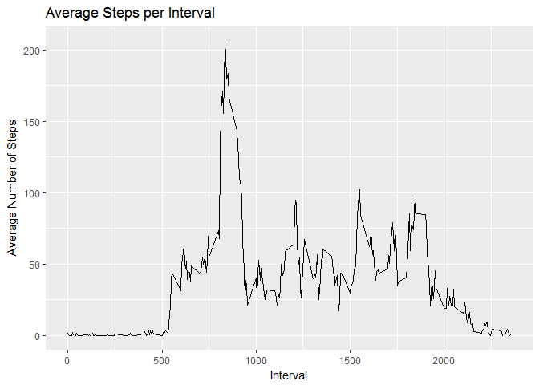

# Reproducible Research: Peer Assessment 1
##Introduction
It is now possible to collect a large amount of data about personal movement using activity monitoring devices such as a Fitbit, Nike Fuelband, or Jawbone Up. These type of devices are part of the “quantified self” movement – a group of enthusiasts who take measurements about themselves regularly to improve their health, to find patterns in their behavior, or because they are tech geeks. But these data remain under-utilized both because the raw data are hard to obtain and there is a lack of statistical methods and software for processing and interpreting the data.

##Assignment
This assignment makes use of data from a personal activity monitoring device. This device collects data at 5 minute intervals through out the day. The data consists of two months of data from an anonymous individual collected during the months of October and November, 2012 and include the number of steps taken in 5 minute intervals each day.

The data for this assignment can be downloaded from the course web site:

Dataset: [Activity monitoring data](https://d396qusza40orc.cloudfront.net/repdata%2Fdata%2Factivity.zip)

The variables included in this dataset are:

**steps**  Number of steps taking in a 5-minute interval (missing values are coded as NA)

**date**  The date on which the measurement was taken in YYYY-MM-DD format

**interval**  Identifier for the 5-minute interval in which measurement was taken

The dataset is stored in a comma-separated-value (CSV) file and there are a total of 17,568 observations in this dataset.

## Loading and preprocessing the data

Create a file directory (if needed)

```r
  if(!file.exists("./data")){dir.create("./data")}
```
Specify the download website, download data, and unzip data file to directory.

```r
  download.file.method = "curl"
  URL <- "https://d396qusza40orc.cloudfront.net/repdata%2Fdata%2Factivity.zip"
  download.file(URL, destfile="./data/moves.zip")
  unzip("./data/moves.zip", junkpaths = TRUE, exdir = "./data/moves")
```
Read csv file into data frame

```r
  moves <-  read.csv("./data/moves/activity.csv", header = TRUE)
```
## What is mean total number of steps taken per day?
Let aggregate steps by date and calculate the total steps and averages for each day.

```r
meandaysteps<-aggregate(steps ~ date , moves, mean)
sumdaysteps<-aggregate(steps ~ date , moves, sum)
```
Now, plot a histogram to explore daily activity:

```r
hist(sumdaysteps$steps, breaks=15, xlab="Daily Steps", main="Histogram of Activity")
```

<!-- -->

And use total steps per day to find the average daily steps:

```r
mean(sumdaysteps$steps, na.rm =TRUE)
```

```
## [1] 10766.19
```
and the median:

```r
median(sumdaysteps$steps, na.rm =TRUE)
```

```
## [1] 10765
```
## What is the average daily activity pattern?
This time, aggregate the steps for each 5 minute interval so we can explore how activity changes throughout the day and determine any daily pattern.

```r
meanintsteps<-aggregate(steps ~ interval , moves, mean)
```
Use ggplot to graph the average number of steps per five minute interval throughout the day.

```r
library(ggplot2)
ggplot(meanintsteps, aes(interval, steps))+geom_line()+labs(title="Average Steps per Interval",x="Interval", y="Average Number of Steps")
```

<!-- -->

##Find the interval with the highest average number of steps:

```r
meanintsteps[which(meanintsteps$steps == max(meanintsteps$steps)), ]
```

```
##     interval    steps
## 104      835 206.1698
```
##Missing values in dataset
Let's examine missing values in our activity data set. How many are missing?

```r
sum(is.na(moves$steps))
```

```
## [1] 2304
```
Whoa, that's about 10% of data missing. What happens if we use the interval average steps as a replacement for those missing values and recalculate daily totals?

```r
for (i in 1:length(moves$steps)){
    if (is.na(moves$steps[i])){
        moves$steps[i]<-meanintsteps[which(meanintsteps$interval == moves$interval[i]), 2]
    }
}
compmeandaysteps<-aggregate(steps ~ date , moves, mean)
compsumdaysteps<-aggregate(steps ~ date , moves, sum)
```
Do the new values impact the histogram of the daily steps?

```r
hist(compsumdaysteps$steps, breaks=15, xlab="Daily Steps", main="Histogram of Activity")
```

<!-- -->

Looks as though the distribution remained the same but the frequencies increased.

How do these new values impact the daily mean and median?

I expect the mean to decrease and the median to remain the same...is that what happens?
Let's calculate the mean:

```r
mean(compsumdaysteps$steps, na.rm =TRUE)
```

```
## [1] 10766.19
```
Hmm, the mean stayed the same. How about the median?

```r
median(compsumdaysteps$steps, na.rm =TRUE)
```

```
## [1] 10766.19
```
Well, the median is now equal to the mean.  Very interesting.

## Are there differences in activity patterns between weekdays and weekends?

Let's create a new data set with a new factor: weekday or weekend. If the day is Saturday or Sunday, assign as weekend day, otherwise assign as weekday.

```r
newmoves<-moves
for (i in 1:length(newmoves$date))
    {
    if (weekdays(as.Date(newmoves$date[i]))=="Saturday" | weekdays(as.Date(newmoves$date[i]))=="Sunday")
        {
        newmoves$wDay[i]<-"weekend"
        }
    else
        {
        newmoves$wDay[i]<-"weekday"
        }
}
```
Aggregate the steps around each interval and weekend/weekday.

```r
newmeanintsteps<-aggregate(steps ~ wDay+interval , newmoves, mean)
```
And finally, lets chart the daily patterns for weekends and weekdays in a over/under chart so we can compare.

```r
ggplot(newmeanintsteps, aes(interval, steps))+geom_line()+facet_grid(wDay ~.)+labs(title="Comparison of Average Steps per Interval: Weekday v Weekend",x="Interval", y="Average Number of Steps")
```

<!-- -->

It certainly looks like there is a difference.  Maybe this person gets to sleep in a bit on weekends, eh?
